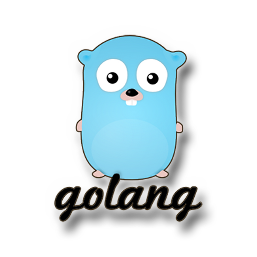

<h1 align=center>Golang Practical Programs</h1>

Run command: `go run foldername/main.go` or run inside folder: `go run main.go`

- <a href="multiplication-table/">Print Multiplication Table of user input</a>
- <a href="simple-calculator/">Simple calculator</a>
- <a href="bmi-calculator/">BMI calculator</a>
